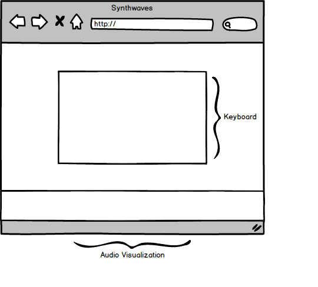

## Soundwaves

### Background  

Synthwaves is a virtual synthesizer that generates sounds from the pentatonic scale, one of humanity's most [fascinatingly widespread](https://www.youtube.com/watch?v=ne6tB2KiZuk) musical constructs. Each sound is created from an audio oscillator of a given frequency.

### Functionality & MVP  

Users will be able to:

- [ ] Play sounds from the keyboard
- [ ] Trigger audio-visualizations

In addition, this project will include:

- [ ] A production README

### Wireframes

This app will consist of a single screen with game board, and a modal with links to the Github, my LinkedIn, my personal site, and a brief description.

### Architecture and Technologies

This project will be implemented with the following technologies:

- Vanilla JavaScript for overall audio and visual logic
- HTML5 with Canvas for DOM manipulation and rendering
- HTML5 WebAudioKit API for audio manipulation
- CSS for styling
- Webpack to bundle and serve up the various scripts

In addition to the webpack entry file, there will be four scripts involved in this project:

`keyboard.js`: handle the logic for creating and updating the necessary keyboard elements and rendering them to the DOM.

`synth.js`: handle interfacing with `HTML5 WebAudioKit API` to create sound

`animation.js`: handle animating the sound visualization on the bottom of the screen

### Implementation Timeline

**Day 1**

Setting up the files structure. Writing the rendering logic. Setting up live url. Learning how to interface with `HTML5 WebAudioKit API`.

**Day 2**

Writing the sequencer logic

**Day 3**

Making random patterns. Styling the board, transitions, and effects.

### Bonus features

There are many directions this sequencer could go.  Some anticipated updates are:

- [ ] Option to share musical creation
- [ ] Ability to add drums
- [ ] Controls for delay, tempo, cutoff, resonance, reverb, release, and attack
